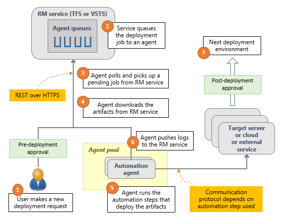

# Introduction to the Release Management service in Visual Studio Team Services
The Release Management service in VSTS is the new platform as a service (PaaS) offering aimed at providing a cloud-based release management solution.  With RM,  the intent is to make the setup, configuration and execution of your release pipeline as streamlined as possible.  This also means that separate RM server and RM clients are no longer required, and your existing Azure subscriptions can be used to spin up and maintain any environments you need for your pipeline.  You are able to use on-prem deployment targets as well.  

Following is a diagram that provides an overview of how the new RM service interacts with your release workflow which illustrates the simplification of the RM infrastructure.

With the new RM service, traceability now exists between build systems (TFS Build vNext as well as Jenkins CI), work items, test plans and more.  The options for integration points are more plentiful, and the new extensible task model allows you to create custom tasks to suit your needs.  All of these benefits are now captured in an easy-to-use web interface.
## Key Features
The key features you will find on the web include:
- The ability to release applications built using Java and .NET to Windows and Linux targets
- A consolidated overview of environments and artifacts per release definition
- Streamlined editors for: 
	- Setting up deployment triggers, including setting up target environments
	- Seting up environments
	- Enabling and selecting reusable tasks
	- Managing any additional variables you may require
- Starter templates for Azure-backed environments as well as templates for overall release plans
- The ability to create environment templates for later use

For further information about the Release Management service, please visit the RM documentation page at [Release Management for VSTS preview version](https://msdn.microsoft.com/Library/vs/alm/Release/overview-rmpreview).
You can also visit [Understanding Release Management](https://msdn.microsoft.com/Library/vs/alm/Release/getting-started/understand-rm), which gives some additional examples around use cases for the Release Management service.