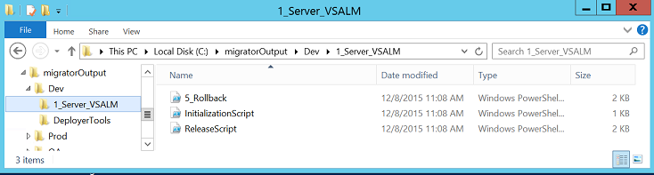

[VISUAL STUDIO ALM RANGERS](http://aka.ms/vsaraboutus)
> PREVIEW – This guide will be updated periodically.

### Introduction ###
This hand on lab (HOL) provides a walk-through of the using the **RMWorkFlowMigrator** tool to export a Release Management Agent based deployment pipeline so that it can be reused in the Release Management service in Visual Studio Team Services (VSTS).

To provide a sample release pipeline to export, this HOL uses the Fabrikam Fiber sample that from the 2015 version of the ALM Virtual Machine ([http://aka.ms/ALMVMs](http://aka.ms/ALMVMs)). The **RMWorkFlowMigrator** supports TFS 2013 Update 4 and later; hence, the 2013 version of the ALM VM is not supported for this HOL as it is based on update 3.

# Lab 1 - Using RMWorkFlowMigrator to create release scripts #

## Preparation ##
Download the 2015 version of the ALM Virtual Machine ([http://aka.ms/ALMVMs](http://aka.ms/ALMVMs)).

> *TIP: You can download the VM using Powershell see the post* [Download Brian Keller's VM with PowerShell](https://binary-stuff.com/post/download-brian-kellers-vm-with-powershell)

The migration tool makes a direct, read only SQL connection to the Release Management databases.  This HOL assumes that the ALM Virtual Machine is running and that the user has logged in as a user with administrative rights; the *vsalm\brian* account is recommended for this lab.

## Step 1 - Install the migration tool on the VM 
1. Download the binary release zip file from [the repository on GitHub](https://github.com/ALM-Rangers/Migrate-assets-from-RM-server-to-VSTS/releases).
1. Connect to the ALM Virtual Machine using RDP or the Hyper-V console.
1. Login as the *vsalm\brian* account.
1. Copy the ZIP file from the Hyper-V host to the desktop on the ALM VM.
1. Unblock and unzip the zip file to a new folder \(e.g. **c:\migrate**\).
1. Open a command prompt, create a directory to accept the results from the tools \(e.g., **MD c:\migratorOutput**\) and change directory to that folder \(e.g., **cd c:\migratorOutput**\).
1. Execute the **RMWorkflowMigrator.exe** executable \(e.g., **c:\migrate\drop\RMWorkflowMigrator.CmdLine\bin\Release\RMWorkFlowMigrator.exe**\). This will display the command line usage and parameters:

		C:\migrate\RMWorkflowMigrator.exe 
		
		Microsoft.ALMRangers.RMWorkflowMigrator 1.0.5799.30900
		Copyright ©2015  Microsoft Corporation
		
		ERROR(S):
		  -n/--SqlServerName required option is missing.
		  -t/--TemplateName required option is missing.
		
		
		  -n, --SqlServerName                 Required. The name of the SQL Server
		                                      hosting the Release Management database.
		
		  -d, --DatabaseName                  (Default: ReleaseManagement) The name of
                                              the Release Management database.
		
		  --ConnectTimeout                    (Default: 15) The length of time (in
		                                      seconds) to wait for a connection to the
		                                      SQL server before terminating the attempt
		                                      and generating an error. By default
		                                      timeout is 15 seconds.
		
		  -l, --NetworkLibrary                The name of the network library used to
		                                      establish a connection to the SQL Server.
		                                      Supported values include dbnmpntw (Named
		                                      Pipes), dbmsrpcn (Multiprotocol),
		                                      dbmsadsn (AppleTalk), dbmsgnet (VIA),
		                                      dbmslpcn (Shared Memory) and dbmsspxn
		                                      (IPX/SPX), and dbmssocn (TCP/IP). The
		                                      corresponding network DLL must be
		                                      installed on the system to which you
		                                      connect. If you do not specify a network
		                                      and you use a local server (for example,
		                                      "." or "(local)"), Shared Memory is used.

		  -t, --TemplateName                  Required. Name of the template to export.
		                                      If the name contains spaces use "the name"
		
		  -s, --TemplateStage                 (Default: ) Stage of the template to
                                              export. If the name contains spaces use
                                              "the name". If omitted, the tool will
                                              extract scripts for all stages.

		
		  -o, --OutputFolder                  (Default: Output) The folder to output
		                                      the migration PowerShell scripts to. Can
		                                      be relative or absolute. If this
		                                      parameter is being enclosed in quotation
		                                      marks, do not include a trailing
		                                      backslash. Ex: "C:\Output", not
		                                      "C:\Output\"
		
		  -c, --CreateParameterizedScripts    (Default: False) Create scripts with
		                                      parameter blocks instead of separate
		                                      initialization scripts
		
		  -v, --Verbose                       (Default: False) Prints the detailed
		                                      messages to standard output.
		                                      
		  -m, --NoMetrics                     (Default: False) Stops all metrics from
		                                      being captured.
		
		  --help                              Display this help screen.

		Microsoft.ALMRangers.RMWorkflowMigrator Tool
		============================================
		OutputFolder:                   Output
		ConnectionString:               Integrated Security=True;Connect Timeout=15
		TemplateName:
		TemplateStage:
		CreateParameterizedScripts:     False
		Verbose:                        False

## Step 2 - Migrating a Stage of a Template ##
To migrate a stage of a template the correct parameters need to be passed to the migration tool. The migration tool requires two parameters as a minimum:
- The SQL server name \(i.e., "-n"\)
- The Template Name \(i.e., "-t"\)

To migrate a single stage of a release template, you can specify the stage with the --TemplateStage parameter, in addition to the two required values stated above.

> **NOTE:** The SqlServerName parameter of **.** \(period\) is being used in this HOL as an alias for the VMs local SQL server. **localhost** or the actual server name could be used. 

> **NOTE:** This is the simplest usage of the tool, generating a connection string that assume Windows integrated security. If you require a different connection script use the **NetworkLibrary** parameter.

1. Enter the following command line:

    	C:\migrate\RMWorkflowMigrator.exe -n . -t "Fabrikam Call Center" 
2. This command will generate the PowerShell release scripts from the migration tool in the **.\output** folder.     
3. Setting more parameters allows more control over the migration.
	- As migrations can take a while depending on the complexity of the stage, it can be useful to see the progress of the migration by adding the -v verbose flag. 
	- As we will want to export a number of stages, it is a good idea to export each stage to a different output folder using -o parameter  
4. Repeat the export with the revised parameters:

        c:\migrate\RMWorkflowMigrator.exe -n . -t "Fabrikam Call Center"  -v -o c:\migratorOutput\
        Microsoft.ALMRangers.RMWorkflowMigrator 1.0.5795.40004
        Copyright c2015  Microsoft Corporation
        
        Release Management version detected: 14.0.23102.0 (2015 RTM)
        
        Connecting to the DB 'ReleaseManagement' on the SQL server '.'
        Generating the scripts for the workflow 'Fabrikam Call Center' stage 'Dev' into folder 'C:\migratorOutput\'
        
        Parsing release template
        Server: VSALM
        Action: Remove Web Site
        Action: Copy File or Folder
        Component: Fabrikam Call Center
        Action: Create Web Site
        Action: Copy File or Folder
        Action: Create Web Site
        Rollback: Rollback
        Done parsing release template
        Generating PowerShell
        ContainerStart: 1 - Server VSALM  IsContainer: True IsEnabled: True
        ActionStart: 1 - Action Remove Web Site  IsContainer: False IsEnabled: True
        ActionEnd: 1 - Action Remove Web Site  IsContainer: False IsEnabled: True
        ActionStart: 2 - Action Copy File or Folder  IsContainer: False IsEnabled: True
        ActionEnd: 2 - Action Copy File or Folder  IsContainer: False IsEnabled: True
        ActionStart: 3 - Component Fabrikam Call Center  IsContainer: False IsEnabled: True
        ActionEnd: 3 - Component Fabrikam Call Center  IsContainer: False IsEnabled: True
        ActionStart: 4 - Action Create Web Site  IsContainer: False IsEnabled: True
        ActionEnd: 4 - Action Create Web Site  IsContainer: False IsEnabled: True
        ContainerStart: 5 - Rollback Rollback  IsContainer: True IsEnabled: True
        ActionStart: 1 - Action Copy File or Folder  IsContainer: False IsEnabled: True
        ActionEnd: 1 - Action Copy File or Folder  IsContainer: False IsEnabled: True
        ActionStart: 2 - Action Create Web Site  IsContainer: False IsEnabled: True
        ActionEnd: 2 - Action Create Web Site  IsContainer: False IsEnabled: True
        ContainerEnd: 5 - Rollback Rollback  IsContainer: True IsEnabled: True
        ContainerEnd: 1 - Server VSALM  IsContainer: True IsEnabled: True
        Done generating PowerShell
        
        Release workflow generated
        
        Connecting to the DB 'ReleaseManagement' on the SQL server '.'
        Generating the scripts for the workflow 'Fabrikam Call Center' stage 'Prod' into folder 'C:\migratorOutput\'
        
        Parsing release template
        Server: VSALM
        Action: Remove Web Site
        Action: Copy File or Folder
        Component: Fabrikam Call Center
        Action: Create Web Site
        Action: Copy File or Folder
        Action: Create Web Site
        Rollback: Rollback
        Done parsing release template
        Generating PowerShell
        ContainerStart: 1 - Server VSALM  IsContainer: True IsEnabled: True
        ActionStart: 1 - Action Remove Web Site  IsContainer: False IsEnabled: True
        ActionEnd: 1 - Action Remove Web Site  IsContainer: False IsEnabled: True
        ActionStart: 2 - Action Copy File or Folder  IsContainer: False IsEnabled: True
        ActionEnd: 2 - Action Copy File or Folder  IsContainer: False IsEnabled: True
        ActionStart: 3 - Component Fabrikam Call Center  IsContainer: False IsEnabled: True
        ActionEnd: 3 - Component Fabrikam Call Center  IsContainer: False IsEnabled: True
        ActionStart: 4 - Action Create Web Site  IsContainer: False IsEnabled: True
        ActionEnd: 4 - Action Create Web Site  IsContainer: False IsEnabled: True
        ContainerStart: 5 - Rollback Rollback  IsContainer: True IsEnabled: True
        ActionStart: 1 - Action Copy File or Folder  IsContainer: False IsEnabled: True
        ActionEnd: 1 - Action Copy File or Folder  IsContainer: False IsEnabled: True
        ActionStart: 2 - Action Create Web Site  IsContainer: False IsEnabled: True
        ActionEnd: 2 - Action Create Web Site  IsContainer: False IsEnabled: True
        ContainerEnd: 5 - Rollback Rollback  IsContainer: True IsEnabled: True
        ContainerEnd: 1 - Server VSALM  IsContainer: True IsEnabled: True
        Done generating PowerShell
        
        Release workflow generated
        
        Connecting to the DB 'ReleaseManagement' on the SQL server '.'
        Generating the scripts for the workflow 'Fabrikam Call Center' stage 'QA' into folder 'C:\migratorOutput\'
        
        Parsing release template
        Server: VSALM
        Action: Remove Web Site
        Action: Copy File or Folder
        Component: Fabrikam Call Center
        Action: Create Web Site
        Action: Copy File or Folder
        Action: Create Web Site
        Rollback: Rollback
        Done parsing release template
        Generating PowerShell
        ContainerStart: 1 - Server VSALM  IsContainer: True IsEnabled: True
        ActionStart: 1 - Action Remove Web Site  IsContainer: False IsEnabled: True
        ActionEnd: 1 - Action Remove Web Site  IsContainer: False IsEnabled: True
        ActionStart: 2 - Action Copy File or Folder  IsContainer: False IsEnabled: True
        ActionEnd: 2 - Action Copy File or Folder  IsContainer: False IsEnabled: True
        ActionStart: 3 - Component Fabrikam Call Center  IsContainer: False IsEnabled: True
        ActionEnd: 3 - Component Fabrikam Call Center  IsContainer: False IsEnabled: True
        ActionStart: 4 - Action Create Web Site  IsContainer: False IsEnabled: True
        ActionEnd: 4 - Action Create Web Site  IsContainer: False IsEnabled: True
        ContainerStart: 5 - Rollback Rollback  IsContainer: True IsEnabled: True
        ActionStart: 1 - Action Copy File or Folder  IsContainer: False IsEnabled: True
        ActionEnd: 1 - Action Copy File or Folder  IsContainer: False IsEnabled: True
        ActionStart: 2 - Action Create Web Site  IsContainer: False IsEnabled: True
        ActionEnd: 2 - Action Create Web Site  IsContainer: False IsEnabled: True
        ContainerEnd: 5 - Rollback Rollback  IsContainer: True IsEnabled: True
        ContainerEnd: 1 - Server VSALM  IsContainer: True IsEnabled: True
        Done generating PowerShell
        
        Release workflow generated
        Total execution time: 292 ms

5. In the **c:\migratorOutput\Fabrikam Call Center\Dev** folder you will find a sub-folder for each server in the stage. This will contain a number of scripts for the release process, rollback steps and initialization. There is also a **DeployerTools** folder that contains all scripts and tools referenced by the exported scripts:

    
	
## Step 3 - Using the generated scripts 
The scripts generated by the **RMWorkflowMigrator** can be used as part of a manual deployment process or by the Release Management service in VSTS.

Instructions on how to make use of them in a deployment pipeline can be found in [Lab 2 - Using the resulting release scripts in a release pipeline](Lab-2-Using-the-resulting-release-scripts-in-a-release-pipeline.md).

---
- **Richard Fennell** is a Visual Studio ALM Ranger 
- **Dave McKinstry** is Visual Studio ALM Ranger and Technical Specialist at Microsoft
- **William H. Salazar** is a Visual Studio ALM Ranger and Sr. Consultant at InCycle Software
