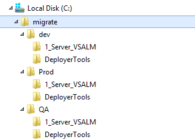
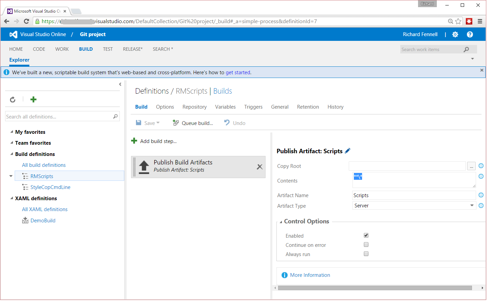
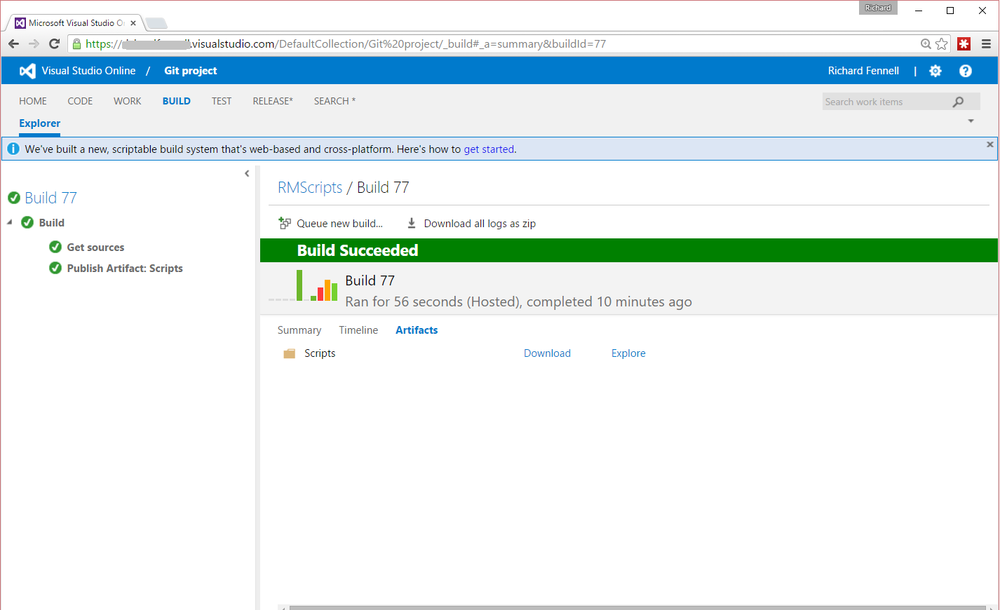
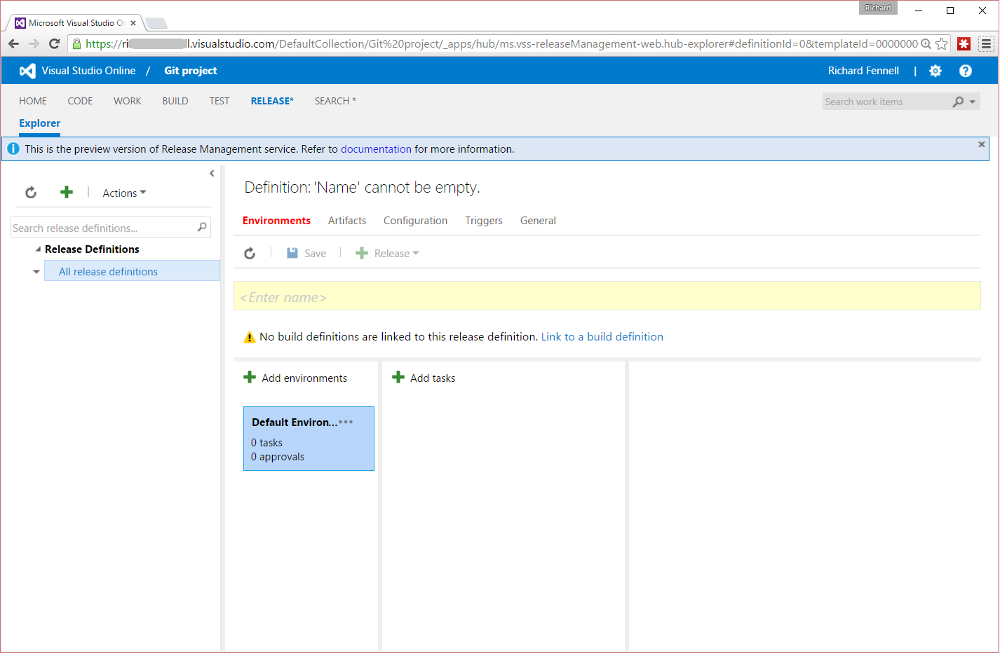
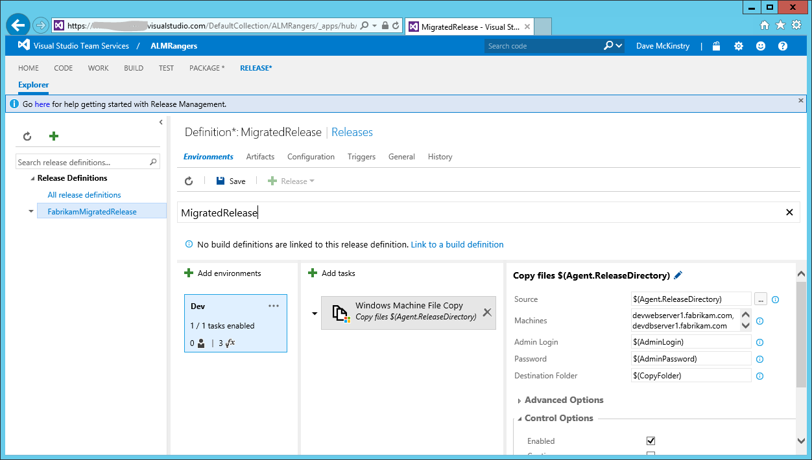
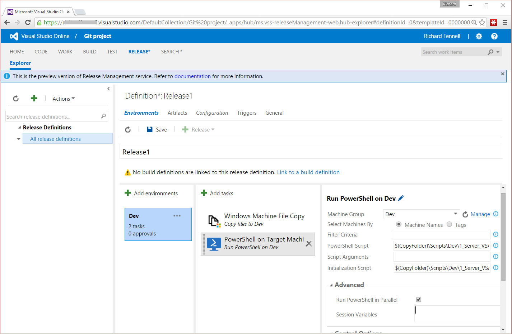
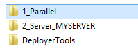
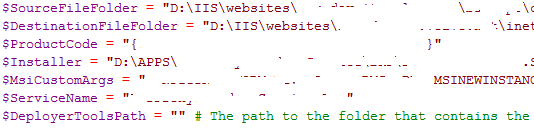
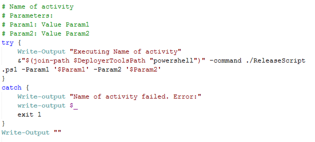

[VISUAL STUDIO ALM RANGERS](http://aka.ms/vsaraboutus)
> PREVIEW – This guide will be updated periodically.

### Introduction ###
This guide provides an overview of using the **RMWorkFlowMigrator** tool to export a Release Management Agent based deployment pipeline so that it can be reused in the Release Management service in Visual Studio Team Services (VSTS).

# RM Workflow Migrator Guide #

## Pre-requisites ##

The **RMWorkFlowMigrator** tool supports TFS 2013 Update 4 and later. The migration tool makes a direct read only SQL connection to the Release Management databases. The account under which the tool will run, needs to have read access to the Release Management databases.

## Installation ##

1.  Download the binary release zip file from [the repository on GitHub](https://github.com/ALM-Rangers/Migrate-assets-from-RM-server-to-VSTS).

2.  Unblock and unzip the zip file to a new folder on workstation (e.g. \*\*c:\*).

3.  Open a command prompt, create a directory to accept the results from the tools (e.g., \*\*MD \*) and change directory to that folder (e.g., \*\*cd \*).

4.  Execute the **RMWorkflowMigrator.exe** executable (e.g., **c:.exe**). This will display the command line usage and parameters:

		C:\migrate\RMWorkflowMigrator.exe 
		
		Microsoft.ALMRangers.RMWorkflowMigrator 1.0.5799.30900
		Copyright ©2015  Microsoft Corporation
		
		ERROR(S):
		  -n/--SqlServerName required option is missing.
		  -t/--TemplateName required option is missing.
		
		
		  -n, --SqlServerName                 Required. The name of the SQL Server
		                                      hosting the Release Management database.
		
		  -d, --DatabaseName                  (Default: ReleaseManagement) The name of
                                              the Release Management database.
		
		  --ConnectTimeout                    (Default: 15) The length of time (in
		                                      seconds) to wait for a connection to the
		                                      SQL server before terminating the attempt
		                                      and generating an error. By default
		                                      timeout is 15 seconds.
		
		  -l, --NetworkLibrary                The name of the network library used to
		                                      establish a connection to the SQL Server.
		                                      Supported values include dbnmpntw (Named
		                                      Pipes), dbmsrpcn (Multiprotocol),
		                                      dbmsadsn (AppleTalk), dbmsgnet (VIA),
		                                      dbmslpcn (Shared Memory) and dbmsspxn
		                                      (IPX/SPX), and dbmssocn (TCP/IP). The
		                                      corresponding network DLL must be
		                                      installed on the system to which you
		                                      connect. If you do not specify a network
		                                      and you use a local server (for example,
		                                      "." or "(local)"), Shared Memory is used.

		  -t, --TemplateName                  Required. Name of the template to export.
		                                      If the name contains spaces use "the name"
		
		  -s, --TemplateStage                 (Default: ) Stage of the template to
                                              export. If the name contains spaces use
                                              "the name". If omitted, the tool will
                                              extract scripts for all stages.

		
		  -o, --OutputFolder                  (Default: Output) The folder to output
		                                      the migration PowerShell scripts to. Can
		                                      be relative or absolute. If this
		                                      parameter is being enclosed in quotation
		                                      marks, do not include a trailing
		                                      backslash. Ex: "C:\Output", not
		                                      "C:\Output\"
		
		  -c, --CreateParameterizedScripts    (Default: False) Create scripts with
		                                      parameter blocks instead of separate
		                                      initialization scripts
		
		  -v, --Verbose                       (Default: False) Prints the detailed
		                                      messages to standard output.
		
		  --help                              Display this help screen.

		Microsoft.ALMRangers.RMWorkflowMigrator Tool
		============================================
		OutputFolder:                   Output
		ConnectionString:               Integrated Security=True;Connect Timeout=15
		TemplateName:
		TemplateStage:
		CreateParameterizedScripts:     False
		Verbose:                        False

## Migrating a Release Management Template - Exporting Release Management Stages ##

To migrate all stages of a release template, the correct parameters need to be passed to the migration tool. The migration tool requires two parameters as a minimum:
- The SQL server name \(i.e., "-n"\)
- The Release Template name \(i.e., "-t"\)

To migrate a single stage of a release template, you can specify the stage with the --TemplateStage parameter, in addition to the two required values stated above.

> **NOTE:** The SqlServerName parameter of **localhost** is being used in this guide to represent the SQL server name. 

> **NOTE:** This is the simplest usage of the tool, generating a connection string that assumes Windows integrated security. If you require a different connection script use the **NetworkLibrary** parameter.

1. Enter the following command line:

    RMWorkflowMigrator.exe -n . -t "<RMTemplate>" -s <RMSTAGE>   
    **Example**: RMWorkflowMigrator.exe -n . -t "Fabrikam Call Center" -s Dev

2. This command will generate the PowerShell release scripts from the migration tool in the **.\output** folder.     
3. Setting more parameters allows more control over the migration.
	- As migrations can take a while depending on the complexity of the stage, it can be useful to see the progress of the migration by adding the -v verbose flag. 
	- A folder structure will automatically be created with corresponding folders for the release template and the stage(s) being extracted.
4. Example output using revised parameters for verbosity, output folder, etc.:

        c:\migrate\RMWorkflowMigrator.exe -n . -t "Fabrikam Call Center"  -s Dev -v -o Dev
        Microsoft.ALMRangers.RMWorkflowMigrator 1.0.5795.40004
        Copyright c2015  Microsoft Corporation
    
        Release Management version detected: 14.0.23102.0 (2015 RTM)
    
        Connecting to the DB 'ReleaseManagement' on the SQL server '.'
        Generating the scripts for the workflow 'Fabrikam Call Center' stage 'Dev' into folder 'Dev'
    
        Parsing release template
        Server: VSALM
        Action: Remove Web Site
        Action: Copy File or Folder
        Component: Fabrikam Call Center
        Action: Create Web Site
        Action: Copy File or Folder
        Action: Create Web Site
        Rollback: Rollback
        Done parsing release template
        Generating PowerShell
        ContainerStart: 1 - Server VSALM  IsContainer: True IsEnabled: True
        ActionStart: 1 - Action Remove Web Site  IsContainer: False IsEnabled: True
        ActionEnd: 1 - Action Remove Web Site  IsContainer: False IsEnabled: True
        ActionStart: 2 - Action Copy File or Folder  IsContainer: False IsEnabled: True
        ActionEnd: 2 - Action Copy File or Folder  IsContainer: False IsEnabled: True
        ActionStart: 3 - Component Fabrikam Call Center  IsContainer: False IsEnabled: True
        ActionEnd: 3 - Component Fabrikam Call Center  IsContainer: False IsEnabled: True
        ActionStart: 4 - Action Create Web Site  IsContainer: False IsEnabled: True
        ActionEnd: 4 - Action Create Web Site  IsContainer: False IsEnabled: True
        ContainerStart: 5 - Rollback Rollback  IsContainer: True IsEnabled: True
        ActionStart: 1 - Action Copy File or Folder  IsContainer: False IsEnabled: True
        ActionEnd: 1 - Action Copy File or Folder  IsContainer: False IsEnabled: True
        ActionStart: 2 - Action Create Web Site  IsContainer: False IsEnabled: True
        ActionEnd: 2 - Action Create Web Site  IsContainer: False IsEnabled: True
        ContainerEnd: 5 - Rollback Rollback  IsContainer: True IsEnabled: True
        ContainerEnd: 1 - Server VSALM  IsContainer: True IsEnabled: True
        Done generating PowerShell
    
        Release workflow generated	

5. In the **Dev** folder there will find a sub-folder for each server in the stage. This will contain a number of scripts for the release process, rollback steps and initialization. There is also a **DeployerTools** folder that contains all scripts and tools referenced by the exported scripts:

    

6. The export process needs to be repeated for the other stages in the pipeline that need to be migrated, if the work-flows are **different**.

	    **Examples:**
		c:\migrate\RMWorkflowMigrator.exe -n . -t "Fabrikam Call Center"  -s QA -v -o QA
	    c:\migrate\RMWorkflowMigrator.exe -n . -t "Fabrikam Call Center"  -s Prod -v -o Prod

> **Note** You only need to extract a work-flow for each stage **if** the stages differ from one another. If the stages **do not differ**, the only difference is in the parameter values used in the scripts.  This means you could just create different versions of the initial script with the correct parameter values for each stage.
> **Note** You can also omit the -s parameter in order for the tool to automatically extract all stages.

## Migrating a Release Management Template - Using the generated scripts in Release Management Service in VSTS
The scripts generated by the **RMWorkflowMigrator** can be used as part of a manual deployment process or by the Release Management service in VSTS. 
This section provides an overview of the process of using the PowerShell scripts generated by the **RMWorkflowMigrator** tool. You will need to upload the generated scripts to VSTS.

## Step 1 - Storing the generated scripts in Source Control 
To make use of the generated PowerShell scripts and associated tools exported by the **RMWorkFlowMigrator** in vNext Release Templates they need to be placed in source control so they can be used as an artifact in a new pipeline.

The **RMWorkFlowMigrator** tool will have exported the steps within the agent based pipeline into a folder structure.  For example, if your generated scripts are located in an output folder called **C:\MigratorOutput**, the resulting structure should look similar to the following: 

 
The method to place this folder structure under source control will be dependent on whether the VSTS Team Project is using TFVC or Git. 

> **Note:** It is important to make sure that any exported tools in the **DeployerTools** folders, as well as the PowerShell script, are also checked into source control. This will not be the default behavior for a Git repo, where a standard [Visual Studio **.gitignore**](https://github.com/github/gitignore/blob/master/VisualStudio.gitignore) will exclude adding binary files. You need to make sure you specially add any excluded files as they are essential to the operation of the exported PowerShell scripts.

## Step 2 - Update **InitializationScript.PS1**
Be especially aware of the **InitializationScript.PS1** file in each folder. These contain variables for the paths to the relevant **DeployerTools**,  non-encrypted parameters that we used in the Agent based pipeline, and non-initialised variables for any encrypted parameters. 
You will need to update this script with the corresponding values for your release before creating a build and release pipeline in VSTS. 

There are a number of options on how **passwords** and **encrypted** parameters can be handled in a new pipeline

1. You could enter the correct values for your system, in plain text, and place them under source control - not recommended as it would mean potentially secret information being stored in source control.
1. You could provide the values for the variable shown in these files using the tools in the release pipeline.
1. A mixture of the two, setting non secret, rarely changing values in the file, and overriding some of the values within the release stage.

## Step 3 - Create a build that contains the exported files 
The Release Management service relies on pulling artifacts to deploy, including scripts, from the output of a VSTS build. This means that the generated scripts and tools need to be added into an artifact by running an automated build that simply copies them to the artifact drop location. This mechanism has the advantage that you can version the scripts, like any other artifact, choosing to deploy an specific version as part of the a given release.
		
To create such a build:

1. Connect to your VSTS instance and select the Build option from the menu at the top of the page
1. Add a new build definition (green + on left of page)
1. Select the option for an empty build
1. Add the task 'Publish Build Artifact'
	-  Set the contents to **\*\*\\\***
	-  Set the Artifact Name to **Scripts**
	-  Set the Artifact Type to **Server**
	
    
	
1. Make sure the repository is set to the repository/location where you stored your scripts
1. Queue this new build, the script files should be copied to the artifact target location

    
	
## Step 4 - Create the Release Pipeline 
Once the script artifact, and any others you require for your product, have been built, they can be used in a release deployment. The following steps show what is required to deploy and run the script artifact.

1. Connect to your VSTS instance and select the Release option on the menu at the top of the page (this will be labelled Release* while the feature is still in preview)
1. Add a new release definition (green + on left of page)
1. Select the option for an empty deployment, this will create a definition with a single default environment and no tasks.

	
	
1.	Set the new definitions name
1.  Click the **Default Environment** and rename it to your first stage e.g. to **Dev**
1.  Press the ** Add Task** button and add the **Deploy** task **Windows Machine File Copy**. Set the following settings
	- Set the **Source** to **$(Agent.ReleaseDirectory)**
	- Click the manage button next to the **Machine Group**. A new tab will open, create a new machine group called **Dev** this should define the target VMs to deploy too.
	- Once you have defined your machines, return to the browser window showing the Release Definitions. Press the refresh button next to the **Machine Group** combo and select the newly created **Dev** machine group
	- Set the **Destination folder** to the target location on the VM e.g. a variable for the release called **$(CopyFolder)** which is created and initialized on the **Configuration** tab
	
	
	
1.  Press the **Add Task** button again and add the **Deploy** task '**PowerShell on Target Machines**'. This task needs to be configured to run the scripts the migration tool generated
	- Set the **Machine Group** to **Dev**
	- Set the **PowerShell Script** to run your targeted script from the deployment location e.g. **$(CopyFolder)\Scripts\Dev\1_Server_VSALM\ReleaseScript.ps1**
	- If you have chosen to store your initialisation script in source control, set the **Initialization Script** to **$(CopyFolder)\Scripts\Dev\1_Server_VSALM\InitializationScript.ps1**
	- If you have not, or plan to override some of the variable, then set the values for the variables in the initialization script in the Advanced pane's **Session Variables**  

	

1.  The initial **Dev** stage of the definition can now be saved.
1.  This process of adding a task can be repeated call further exported PowerShell scripts within the same Stage to deploy to a other VMs.
1.  Finally further environments and stages e.g: **QA** and **Prod** can be added, each with their own series and tasks and parameters.
1.  The release pipeline can now be run.

## Appendix
Here you will find more details about the scripts generated by the migration tool. 

After running the migration there will be a set of folders and scripts that contains the necessary code to perform the release like the old deployment agents usually do. 

For example, here we have the output from a migration, and you can see the **DeployerTools** (already mentioned above) 
	

**RMWorkFlowMigrator** tool creates folders for each container (Parallel, Sequence, Rollback, Server, etc...) and it adds a number in front of the folder name indication the running order. 

Under each folder, you will find the following scripts:

- **InitializationScript.ps1**
	- All variables that are used in the release template are declared here
	- All variables that will be used in the other scripts
	- Some values, usually paths, can not be figured out automatically and they are left blank and the user **must** fill all blanks in
	
	
  
- **ReleaseScript.ps1**
	- Runs the release and executes the tools required from **DeployerTools** 
	- Fully auto-generated
	- Contains code blocks that will run the tools following this structure:
	

- "**1\_RollbackAlways.ps1**" or "**1\_Rollback.ps1**" (if there are more "Rollback" items, they will be numbered in sequence
	- It is the script that runs from the catch section of the **ReleaseScript.ps1**
	- It has the same template, try catch blocks, as **ReleaseScript.ps1**

If you have used the replacement of variables from VS Release Management, you will find in **DeployerTools** a script called **TokenizationScript.ps1**. It is called before the installation and will replace the values the same way as VS Release Management does. This script was developed and is provided with **RMWorkFlowMigrator** tool.

## Conclusion

This guide should provide you with a general understanding of how use the **RMWorkFlowMigrator** tool to export Release Management 2013 template stages in a manner that can be used to build releases in Release Management service in Visual Studio Team Services (VSTS).

Thanks for taking the time to read this and watch for more articles from the [ALM Rangers](http://aka.ms/vsarunderstand).

---
- **Richard Fennell** is a Visual Studio ALM Ranger 
- **Dave McKinstry** is Visual Studio ALM Ranger and Technical Specialist at Microsoft
- **William H. Salazar** is a Visual Studio ALM Ranger and Sr. Consultant at InCycle Software
- **Fabio Stawinski** is a Visual Studio ALM Ranger

